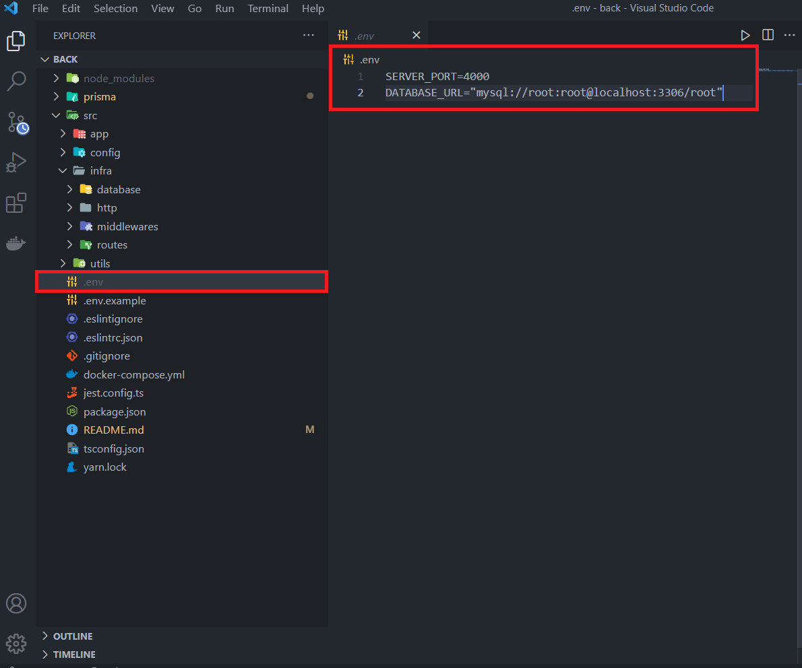

## node_loja_backend

### Requisitos do sistema:
- Node
- Docker
- MySQL

#### Passo a Passo para instalação:

1. Baixar repositório do GIT
2. Instalar as dependências com o comando:
    * npm install
    * yarn
3. Rodar a imagem do docker que vai iniciar o banco de dados com o comando:
    * docker-compose up -d
4. Criar um arquivo ".env" e copiar o modelo de "env.example" na raiz do projeto.

5. Rodar o comando para iniciar as tabelas do banco de dados:
    * npx prisma migrate dev
    * yarn prisma migrate dev
6. Rodar o sistema com o script:
    * npm run dev
    * yarn dev 